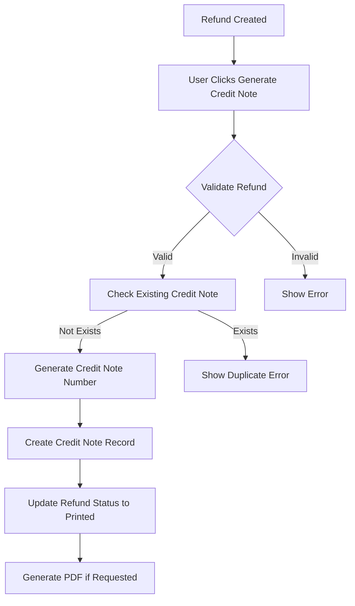

# PowerSuite Refund Module Documentation

## Table of Contents
1. [Overview](#overview)
2. [Database Architecture](#database-architecture)
3. [Business Logic & Workflow](#business-logic--workflow)
4. [API Endpoints](#api-endpoints)
5. [Frontend Components](#frontend-components)
6. [Credit Note Integration](#credit-note-integration)
7. [Validation Rules](#validation-rules)
8. [Recent Improvements](#recent-improvements)
9. [Known Limitations](#known-limitations)
10. [Future Enhancements](#future-enhancements)

## Overview

The PowerSuite Refund Module is a comprehensive system for managing refunds in a travel booking platform. It handles refunds for all service types including flights, hotels, tours, trains, car transfers, car rentals, insurance, VISA, and cruises. The system automatically generates both credit notes (for customer refunds) and debit notes (for supplier refunds).

### Key Features
- **Complete multi-service refund support**: Flight, Hotel, Tour, Train, CarTransfer, CarRental, Insurance, VISA, Cruise
- Automatic credit note generation for customer refunds
- Automatic debit note generation for supplier refunds
- Service-specific refund handlers with intelligent validation
- Full and partial refund support for all service types
- Time-based refund policies with automatic calculation
- Segment-level refund tracking for flights and trains
- Passenger/participant selection for all applicable services
- Customer and supplier refund amount management
- Journal entry integration for accounting
- Status-based workflow management

## Database Architecture

### Primary Tables

#### 1. **refunds** Table
```sql
CREATE TABLE refunds (
    id INT PRIMARY KEY AUTO_INCREMENT,
    order_no VARCHAR(255),
    service_id INT NOT NULL REFERENCES services(id),
    invoice_id INT REFERENCES invoices(id),
    cost_id INT REFERENCES costs(id),
    refund_no VARCHAR(255) UNIQUE,
    invoice_no VARCHAR(255),
    cost_document_number VARCHAR(255),
    customer_name VARCHAR(255),
    supp_name VARCHAR(255),
    passenger_name TEXT,
    refund VARCHAR(255),  -- City segments
    refund_notice VARCHAR(255),
    branch_id INT REFERENCES branches(id),
    status ENUM('Void', 'Printed', 'Raised'),
    je_generated BOOLEAN,
    form_of_payment VARCHAR(255),
    currency_code VARCHAR(10),
    customer_refund_amount DECIMAL(10,2),
    supplier_refund_amount DECIMAL(10,2),
    refund_remarks TEXT,
    voucher_no JSON,
    bank_in_to VARCHAR(255),
    customer_refund_complete VARCHAR(1),
    supplier_refund_complete VARCHAR(1),
    selected_tickets JSON,
    selected_segments JSON,
    selected_passengers JSON,
    service_type ENUM('Flight','Hotel','Insurance','Tour','CarRental','CarTransfer','VISA','Train','Cruise') NOT NULL DEFAULT 'Flight',
    service_details JSON COMMENT 'Service-specific refund details',
    sales DECIMAL(10,2),
    orderId INT NOT NULL,
    created_at TIMESTAMP DEFAULT CURRENT_TIMESTAMP,
    updated_at TIMESTAMP DEFAULT CURRENT_TIMESTAMP ON UPDATE CURRENT_TIMESTAMP
);
```

#### 2. **credit_notes** Table
```sql
CREATE TABLE credit_notes (
    id INT PRIMARY KEY AUTO_INCREMENT,
    doc_no INT,
    doc_date DATE,
    doc_type VARCHAR(50) DEFAULT 'Credit Note',
    reference VARCHAR(255) UNIQUE,  -- Format: {BranchPrefix}CN{8-digit-number}
    client_refrence VARCHAR(255),   -- Links to refund.refund_no
    amount DECIMAL(10,2),
    billing_amount DECIMAL(10,2),
    base_amount DECIMAL(10,2),
    refund_amount DECIMAL(10,2),
    currency_id VARCHAR(10),
    doc_status VARCHAR(50),
    customer_id INT,
    supplier_id INT,
    to VARCHAR(255),
    remarks TEXT,
    request_by VARCHAR(255),
    approved_by VARCHAR(255),
    type VARCHAR(50),
    bank_id INT,
    card_number VARCHAR(50),
    card_type VARCHAR(50),
    created_at TIMESTAMP DEFAULT CURRENT_TIMESTAMP,
    updated_at TIMESTAMP DEFAULT CURRENT_TIMESTAMP ON UPDATE CURRENT_TIMESTAMP
);
```

#### 3. **debit_notes** Table
```sql
CREATE TABLE debit_notes (
    id INT PRIMARY KEY AUTO_INCREMENT,
    doc_no INT,
    doc_date DATE,
    doc_type VARCHAR(50) DEFAULT 'Debit Note',
    reference VARCHAR(255) UNIQUE,  -- Format: {BranchPrefix}DN{8-digit-number}
    client_reference VARCHAR(255),  -- Links to refund.refund_no
    order_no VARCHAR(255),
    amount DECIMAL(10,2),
    amount_base DECIMAL(10,2),
    billing_amount DECIMAL(10,2),
    billing_amount_base DECIMAL(10,2),
    base_amount DECIMAL(10,2),
    base_amount_base DECIMAL(10,2),
    refund_amount DECIMAL(10,2),
    refund_amount_base DECIMAL(10,2),
    currency_id VARCHAR(10),
    base_currency_id INT,
    exchange_rate DECIMAL(10,5),
    exchange_rate_date DATE,
    doc_status VARCHAR(50),
    supplier_id INT,
    supplier_name VARCHAR(255),
    supplier_address TEXT,
    from_company VARCHAR(255),
    remarks TEXT,
    branch_id INT REFERENCES branches(id),
    created_by INT REFERENCES users(id),
    created_at TIMESTAMP DEFAULT CURRENT_TIMESTAMP,
    updated_at TIMESTAMP DEFAULT CURRENT_TIMESTAMP ON UPDATE CURRENT_TIMESTAMP
);
```

### Key Relationships
- `refunds.service_id` → `services.id` (One refund per service)
- `refunds.invoice_id` → `invoices.id` (Links to original invoice)
- `refunds.cost_id` → `costs.id` (Links to cost document)
- `refunds.branch_id` → `branches.id` (Branch association)
- `credit_notes.client_refrence` → `refunds.refund_no` (Credit note to refund linking)
- `debit_notes.client_reference` → `refunds.refund_no` (Debit note to refund linking)

## Business Logic & Workflow

### Refund Creation Process

#### 1. **Eligibility Criteria**
- Service must have a valid, paid invoice
- Service must have associated cost documents
- No existing active refund for the same service
- Service-specific requirements:
  - **Flight**: At least one segment must be selected
  - **Train**: At least one passenger/seat must be selected for partial refunds
  - **Tour**: At least one participant must be selected for partial refunds
  - **CarTransfer**: At least one passenger must be selected for partial refunds
  - **Hotel**: At least one room or night must be selected
  - **Other services**: Full refund by default

#### 2. **Refund Number Generation**
```javascript
Format: {BranchPrefix}RF{7-digit-sequence}
Example: LHERF0000001, KCHRF0000002
```

#### 3. **Status Lifecycle**
```
[Raised] → [Printed] → [Void]
```
- **Raised**: Initial status, refund created but not processed
- **Printed**: Credit note generated, refund processed
- **Void**: Refund cancelled/voided

#### 4. **Workflow Steps**
1. User selects services from order for refund
2. System validates eligibility
3. User enters customer and supplier refund amounts
4. Refund is created with "Raised" status
5. Credit note is generated (manual trigger)
6. Status changes to "Printed"
7. Journal entries are posted (if configured)

### Credit Note Generation

#### 1. **Numbering Format**
```javascript
Format: {BranchPrefix}CN{8-digit-sequence}
Example: LHECN00000001, KCHCN00000002
```

#### 2. **Generation Rules**
- One credit note per refund
- Generated after refund is saved
- Links to refund via `client_refrence` field
- Cannot be regenerated if already exists
- Status set to "Printed" upon creation

### Debit Note Generation

#### 1. **Numbering Format**
```javascript
Format: {BranchPrefix}DN{8-digit-sequence}
Example: LHEDN00000001, KCHDN00000002
```

#### 2. **Generation Rules**
- One debit note per refund for supplier refunds
- Generated after refund is saved
- Links to refund via `client_reference` field
- Stores snapshot of supplier refund amount at creation
- Status set to "Printed" upon creation
- Can be voided and regenerated (similar to credit notes)
- Includes service-specific details based on service type

#### 3. **Service-Specific Display**
Debit notes display different information based on service type:
- **Flight**: Route segments, airline details, PNR
- **Hotel**: Hotel name, location, check-in/out dates, room details
- **Tour**: Package name, destination, tour dates
- **Train**: Company, route, class, departure/arrival times
- **CarTransfer**: Provider, transfer type, pick-up/drop-off locations and times
- **Other Services**: Generic service information

## API Endpoints

### Refund Endpoints

#### 1. **Create Refund (Bulk)**
```http
POST /invoice/refund
Authorization: Bearer {token}
Content-Type: application/json

{
  "data": {
    "data": [{
      "order_no": "ORD001",
      "service_id": 123,
      "invoice_id": 456,
      "refund_no": "LHERF0000001",
      "customer_refund_amount": 1000.00,
      "supplier_refund_amount": 900.00,
      "selected_segments": [{...}],
      "selected_tickets": ["TKT001"],
      "selected_passengers": [{...}]
    }]
  }
}
```

#### 2. **Get Refund Details**
```http
GET /invoice/refund/{refund_no}
Authorization: Bearer {token}
```

#### 3. **Update Refund**
```http
PUT /invoice/refund/{refund_no}
Authorization: Bearer {token}
Content-Type: application/json

{
  "refundData": {
    "customer_refund_amount": 1500.00,
    "supplier_refund_amount": 1350.00,
    "status": "Printed"
  }
}
```

#### 4. **Delete Refund**
```http
DELETE /invoice/refund/{refund_no}
Authorization: Bearer {token}
```
*Note: Only refunds with "Raised" status can be deleted*

#### 5. **List Refunds**
```http
GET /invoice/refund?orderId={orderId}&status={status}
Authorization: Bearer {token}
```

### Credit Note Endpoints

#### 1. **Create Credit Note**
```http
POST /invoice/creditNote
Authorization: Bearer {token}
Content-Type: application/json

{
  "refund_id": 123
}
```

#### 2. **Void Credit Note**
```http
PUT /credit-note/{reference}/void
Authorization: Bearer {token}
```

#### 3. **Generate Credit Note PDF**
```http
GET /invoice/generateCreditNote/{refundId}
Authorization: Bearer {token}
```

### Debit Note Endpoints

#### 1. **Create Debit Note**
```http
POST /debit-note
Authorization: Bearer {token}
Content-Type: application/json

{
  "refund_id": 123
}
```

#### 2. **Void Debit Note**
```http
PUT /debit-note/{reference}/void
Authorization: Bearer {token}
```

#### 3. **Get Debit Note by Reference**
```http
GET /debit-note/{reference}
Authorization: Bearer {token}
```

#### 4. **Get Debit Notes by Refund Number**
```http
GET /debit-note/refund/{refundNo}
Authorization: Bearer {token}
```

#### 5. **Generate Debit Note PDF**
```http
GET /invoice/generateDebitNote/{refundId}
Authorization: Bearer {token}
```

#### 6. **List All Debit Notes**
```http
GET /debit-note?status={status}&branch_id={id}&supplier_id={id}
Authorization: Bearer {token}
```

## Frontend Components

### Main Components

#### 1. **Refund.jsx** (`/psfront/src/pages/Order/Refund.jsx`)
- Main refund creation interface
- Service selection with checkboxes (supports all service types)
- Tabs for refundable services and existing refunds
- Service-specific validation (Flight segments, Hotel rooms, Tour participants, etc.)
- Real-time refund number generation
- Automatic service type detection and data extraction

#### 2. **RefundDetail.jsx** (`/psfront/src/pages/Order/RefundDetail.jsx`)
- Detailed refund view and editing
- Service-specific passenger/participant selection
- Refund amount modification
- Credit note generation trigger
- Debit note generation trigger
- Print and export functionality
- Service-specific validation and locking mechanisms

#### 3. **ServiceRefundSelector.jsx** (`/psfront/src/components/refund/ServiceRefundSelector.jsx`)
- Dynamic service-specific refund component loader
- Routes to appropriate refund selector based on service type
- Supports: Flight, Hotel, Tour, Train, CarTransfer, CarRental, Insurance, VISA, Cruise

#### 4. **Service-Specific Refund Selectors**
- **HotelRefundSelector.jsx**: Room and night selection with calendar
- **TourRefundSelector.jsx**: Participant selection with refund type (full/partial)
- **TrainRefundSelector.jsx**: Passenger and seat selection
- **CarTransferRefundSelector.jsx**: Passenger selection for transfers
- **CarRentalRefundSelector.jsx**: Rental period and extras selection
- **InsuranceRefundSelector.jsx**: Policy and coverage selection
- **VisaRefundSelector.jsx**: Applicant selection
- **CruiseRefundSelector.jsx**: Cabin and passenger selection

#### 5. **CustomerAndSupplierRefund.jsx** (`/psfront/src/components/CustomerAndSupplierRefund.jsx`)
- Refund amount entry form
- Customer refund section
- Supplier refund section
- Currency and payment method display

#### 6. **CreditNote.jsx** (`/psfront/src/components/CreditNote.jsx`)
- Credit note listing and search
- Status filtering
- Company-based access control
- Links to refund details

### Key UI Features
- Real-time search and filtering
- Status-based color coding
- Validation messages and warnings
- Responsive table layouts
- Print-friendly document generation

## Credit Note Integration

### Creation Flow


### Validation Rules
1. Refund must exist in database
2. Refund must have valid refund number
3. For flights: segments must be selected
4. No duplicate credit notes allowed
5. Credit note number must be unique per branch

## Validation Rules

### Frontend Validations
1. **Service Selection**
   - At least one service must be selected
   - Selected services must have invoices and cost documents

2. **Segment Selection (Flights)**
   - At least one segment required for flight refunds
   - Segments linked to passengers

3. **Amount Validation**
   - Customer refund ≤ Supplier refund
   - Amounts must be numeric
   - Cannot exceed original invoice amount

### Backend Validations
1. **Refund Creation**
   - Service must exist
   - Invoice must be valid
   - No duplicate refund numbers
   - Branch must be valid

2. **Credit Note Creation**
   - Refund must exist
   - Segments required for flights
   - No duplicate credit notes
   - Valid branch prefix

3. **Status Transitions**
   - Only "Raised" status refunds can be deleted
   - Status progression must follow lifecycle
   - Cannot void printed credit notes without permission

4. **Refund Update Restrictions**
   - Cannot update refund if active (non-voided) credit notes exist
   - Must void all associated credit notes before editing refund
   - Frontend and backend validation enforced

## Recent Improvements

### 1. **Segment Selection Enforcement**
- Added mandatory segment selection for flight refunds
- Frontend validation prevents submission without segments
- Backend validation rejects refunds without segments
- Clear error messages guide users

### 2. **Sequential Processing**
- Ensured refund is fully saved before credit note creation
- Added async/await handling for proper flow
- Implemented success checks before navigation
- Added small delays for database consistency

### 3. **Enhanced Data Tracking**
- Added JSON fields for selected segments, tickets, passengers
- Improved segment extraction from flight services
- Better passenger-segment relationship tracking

### 4. **User Experience**
- Added warning messages for missing selections
- Dynamic button text based on selection state
- Tooltip hints for better guidance
- Status-based visual indicators

### 5. **Credit Note Independence**
- Credit notes now store snapshot of refund amounts
- Credit note documents remain unchanged when refund is updated
- Amount displayed comes from credit note record, not refund
- Ensures document integrity after creation

### 6. **Void Management Improvements**
- Voiding credit note no longer voids the associated refund
- Refund can generate new credit notes after voiding previous ones
- Added "Void Refund" functionality that voids both refund and all credit notes
- Proper watermark display for voided credit notes

### 7. **Refund Locking Mechanism**
- Refunds with active credit notes are locked for editing
- Clear visual indicators when refund is locked
- Alert banner explaining why refund cannot be edited
- Input fields and save button disabled when locked

## Known Limitations

### 1. **Missing Features**
- ~~No credit note regeneration after voiding~~ ✅ Implemented
- Limited approval workflow
- No bulk refund operations
- Missing refund reversal mechanism

### 2. **Business Logic Gaps**
- No automatic refund calculation
- Missing tax and fee breakdown
- Limited currency conversion support
- No partial refund tracking

### 3. **Integration Issues**
- Incomplete journal entry automation
- Limited payment gateway integration
- No real-time supplier communication
- Missing notification system

### 4. **Audit & Compliance**
- Limited change tracking
- No comprehensive audit logs
- Missing approval hierarchy
- No compliance reporting

## Future Enhancements

### ~~Priority 1: Credit Note Management~~ ✅ Completed
Credit notes can now be regenerated after voiding. The system properly handles multiple credit notes per refund.

## API Updates

### New Endpoints

#### 1. **Void Refund**
```http
PUT /invoice/refund/{refund_no}/void
Authorization: Bearer {token}
```
*Voids the refund and all associated credit notes*

### Updated Business Rules

#### Credit Note Voiding
- Voiding a credit note only affects the credit note itself
- Refund remains active and can issue new credit notes
- Multiple credit notes can exist for one refund (voided + active)

#### Refund Editing Restrictions
- Refunds cannot be edited if active credit notes exist
- Returns 403 error with message about voiding credit notes first
- Frontend disables all input fields and shows warning

#### Credit Note Document Independence
- Credit notes store amount snapshot at creation time
- Document values (amount, billing_amount, refund_amount) are independent
- Template uses credit note's stored values, not refund's current values

### Priority 2: Approval Workflow
```javascript
// Proposed status flow
[Draft] → [Pending Approval] → [Approved] → [Processed] → [Completed]

// Role-based permissions:
- Staff: Create draft
- Supervisor: Approve < $1000
- Manager: Approve < $5000
- Director: Approve any amount
```

### Priority 3: Advanced Calculations
```javascript
// Automatic refund calculation
calculateRefund(service) {
  baseAmount = invoice.amount
  - cancellationFee
  - processingFee
  + taxes (if refundable)
  + fees (if refundable)
  return refundAmount
}
```

### Priority 4: Reporting & Analytics
- Refund trend analysis
- Cancellation patterns
- Supplier performance metrics
- Customer refund history
- Financial impact reports

### Priority 5: Integration Enhancements
- Real-time payment processing
- Automated supplier notifications
- Email/SMS confirmations
- Accounting system sync
- Document management integration

## Code Locations Reference

### Backend Files
- `/psback/models/refund.js` - Refund data model
- `/psback/models/credit_note.js` - Credit note model
- `/psback/models/debit_note.js` - Debit note model
- `/psback/controllers/invoice.controller.js` - Main refund/credit logic
- `/psback/controllers/credit_note.controller.js` - Credit note management
- `/psback/controllers/debit_note.controller.js` - Debit note management
- `/psback/services/refund/BaseRefundHandler.js` - Base handler class
- `/psback/services/refund/RefundHandlerFactory.js` - Service handler factory
- `/psback/services/refund/handlers/FlightRefundHandler.js` - Flight refund logic
- `/psback/services/refund/handlers/HotelRefundHandler.js` - Hotel refund logic
- `/psback/services/refund/handlers/TourRefundHandler.js` - Tour refund logic
- `/psback/services/refund/handlers/TrainRefundHandler.js` - Train refund logic
- `/psback/services/refund/handlers/CarTransferRefundHandler.js` - Car transfer refund logic
- `/psback/services/refund/handlers/CarRentalRefundHandler.js` - Car rental refund logic
- `/psback/services/refund/handlers/InsuranceRefundHandler.js` - Insurance refund logic
- `/psback/services/refund/handlers/VisaRefundHandler.js` - VISA refund logic
- `/psback/services/refund/handlers/CruiseRefundHandler.js` - Cruise refund logic
- `/psback/routes/invoice.route.js` - Refund API routes
- `/psback/routes/creditNote.route.js` - Credit note routes
- `/psback/routes/debitNote.route.js` - Debit note routes
- `/psback/views/pages/debitNote.ejs` - Debit note template
- `/psback/services/journal.js` - Journal entry posting

### Frontend Files
- `/psfront/src/pages/Order/Refund.jsx` - Refund creation UI
- `/psfront/src/pages/Order/RefundDetail.jsx` - Refund details/edit
- `/psfront/src/components/CustomerAndSupplierRefund.jsx` - Amount entry
- `/psfront/src/components/CreditNote.jsx` - Credit note listing
- `/psfront/src/components/refund/ServiceRefundSelector.jsx` - Service selector router
- `/psfront/src/components/refund/HotelRefundSelector.jsx` - Hotel-specific UI
- `/psfront/src/components/refund/TourRefundSelector.jsx` - Tour-specific UI
- `/psfront/src/components/refund/TrainRefundSelector.jsx` - Train-specific UI
- `/psfront/src/components/refund/CarTransferRefundSelector.jsx` - Car transfer-specific UI
- `/psfront/src/components/refund/CarRentalRefundSelector.jsx` - Car rental-specific UI
- `/psfront/src/components/refund/InsuranceRefundSelector.jsx` - Insurance-specific UI
- `/psfront/src/components/refund/VisaRefundSelector.jsx` - VISA-specific UI
- `/psfront/src/components/refund/CruiseRefundSelector.jsx` - Cruise-specific UI
- `/psfront/src/api/order.js` - Refund API calls
- `/psfront/src/api/creditNote.js` - Credit note API calls

## Testing Checklist

### Functional Tests
- [ ] Create refund with single service
- [ ] Create refund with multiple services
- [ ] Validate segment selection for flights
- [ ] Generate credit note successfully
- [ ] Void credit note
- [ ] Delete refund (Raised status only)
- [ ] Update refund amounts
- [ ] Search and filter refunds
- [ ] Export credit note PDF

### Edge Cases
- [ ] Attempt refund without invoice
- [ ] Attempt refund without segments
- [ ] Create duplicate credit note
- [ ] Delete non-raised refund
- [ ] Exceed invoice amount
- [ ] Invalid currency codes
- [ ] Missing branch prefix
- [ ] Concurrent refund creation

### Integration Tests
- [ ] Journal entry generation
- [ ] PDF generation
- [ ] Email notifications
- [ ] Accounting sync
- [ ] Report generation

## Conclusion

The PowerSuite Refund Module provides a solid foundation for refund management in a travel booking system. The recent major improvements have transformed credit note lifecycle management, implementing proper document independence, void management, and refund locking mechanisms. The system now ensures complete data integrity by preventing refund modifications after credit note generation, while still allowing flexibility through the void and regeneration workflow.

## Recent Major Updates (January 2025)

### Credit Note System Overhaul
1. **Document Independence**: Credit notes now store snapshot data at creation time
2. **Void Separation**: Voiding credit notes no longer affects refunds
3. **Regeneration Support**: New credit notes can be created after voiding
4. **Refund Locking**: Prevents editing refunds with active credit notes

### New Features Added (January 2025)
- ✅ Void Refund functionality (voids both refund and credit notes)
- ✅ Credit note regeneration after voiding
- ✅ Refund editing restrictions with active credit notes
- ✅ Visual indicators for locked refunds
- ✅ Proper VOID watermark display on documents

### Technical Improvements
- Backend validation for refund updates
- Frontend UI/UX enhancements for locked states
- Database query optimizations for credit note fetching
- Template updates for independent document rendering

## Recent Major Updates (February 2025)

### Multi-Service Refund Support Completion
The refund module has been extended to support **all service types** with full functionality:

#### ✅ **New Service Types Added**
1. **Tour Service Refunds**
   - Full package or partial participant refunds
   - Time-based refund policies (>60 days = 100%, <7 days = 10%)
   - Package and destination tracking
   - Participant-wise selection and validation

2. **Train Service Refunds**
   - Full journey or partial passenger refunds
   - Time-based policies (>30 days = 95%, <2 days = 10%)
   - Company, route, and class information
   - Seat and passenger selection

3. **Car Transfer Service Refunds**
   - Full transfer or partial passenger refunds
   - Time-based policies (>48hrs = 100%, <6hrs = 10%)
   - Transfer type, provider, and location tracking
   - Pick-up/drop-off time management

#### ✅ **Debit Note System Implementation**
- Complete debit note generation for supplier refunds
- Service-specific detail display on debit notes
- Independent document management (similar to credit notes)
- Void and regeneration support
- PDF generation with proper formatting

#### ✅ **Backend Architecture Enhancements**
- Service-specific refund handler pattern
- `BaseRefundHandler` abstract class for common logic
- `RefundHandlerFactory` for dynamic handler selection
- Individual handlers for each service type:
  - FlightRefundHandler
  - HotelRefundHandler
  - TourRefundHandler (NEW)
  - TrainRefundHandler (NEW)
  - CarTransferRefundHandler (NEW)
  - CarRentalRefundHandler
  - InsuranceRefundHandler
  - VisaRefundHandler
  - CruiseRefundHandler

#### ✅ **Frontend Component System**
- `ServiceRefundSelector` dynamic component router
- Service-specific refund selectors for all types
- Consistent UI/UX across all service types
- Real-time validation and refund preview
- Time-based refund percentage calculations

#### ✅ **Database Updates**
- Added `CarTransfer` to service_type ENUM
- `service_details` JSON field for flexible service-specific data
- Support for debit notes with proper relationships

#### Technical Implementation Details
- Updated all backend controllers to include new service models
- Enhanced debit note template with service-specific sections
- Updated frontend refund creation and editing workflows
- Added comprehensive validation for each service type
- Implemented full and partial refund logic for all services

### Supported Refund Features by Service Type

| Service Type | Full Refund | Partial Refund | Time-Based Policy | Special Features |
|-------------|-------------|----------------|-------------------|------------------|
| Flight | ✅ | ✅ (Segments) | ✅ | Multi-segment journeys |
| Hotel | ✅ | ✅ (Rooms/Nights) | ✅ | Cancellation policy integration |
| Tour | ✅ | ✅ (Participants) | ✅ | Package component tracking |
| Train | ✅ | ✅ (Passengers) | ✅ | Seat selection |
| CarTransfer | ✅ | ✅ (Passengers) | ✅ | VIP meet & greet |
| CarRental | ✅ | ✅ (Days/Extras) | ✅ | Early return calculation |
| Insurance | ✅ | ✅ (Coverage) | ✅ | Policy-based refunds |
| VISA | ✅ | ✅ (Applicants) | ✅ | Application status tracking |
| Cruise | ✅ | ✅ (Cabins) | ✅ | Shore excursion management |

---
*Document Version: 3.0*
*Last Updated: February 2025*
*Author: System Development Team*
*Major Revision: Complete multi-service refund and debit note implementation*